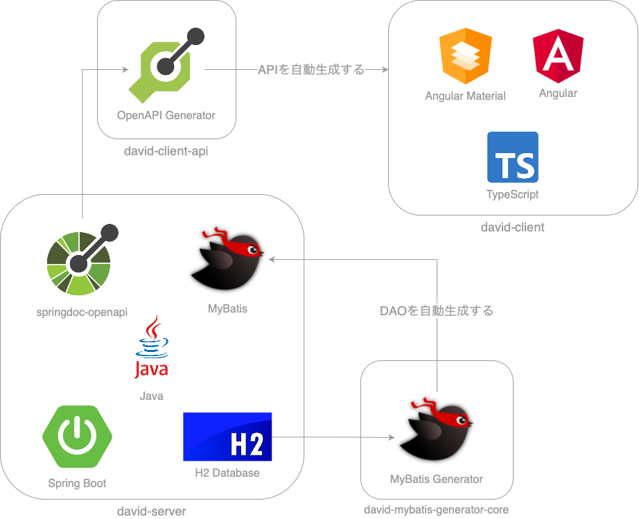

# David

学習のために、作成したWebアプリケーションです。

つぎのリポジトリから、構成されます。

- [david-client](https://github.com/y-chip/david-client)
- [david-server](https://github.com/y-chip/david-server)
- [david-mybatis-generator-core](https://github.com/y-chip/david-mybatis-generator-core)
- [david-client-api](https://github.com/y-chip/david-client-api)

## デモ

準備中です。

## アーキテクチャ

## アーキテクチャの構成要素

### david-client

シングルページアプリケーションのクライアントです。

#### TypeScript

Microsoftが開発した、プログラミング言語です。

JavaScriptに「静的型付け」と「クラスベースのオブジェクト指向」をもたらします。

#### Angular

Googleが開発した、フレームワークです。

フルスタックであり、フロントエンドに必要な機能が揃っています。

#### Angular Material

Googleが開発した、UIコンポーネントライブラリです。

高品質なUIコンポーネントが揃っています。

### david-server

WebAPIを提供する、サーバーです。

#### Java

「静的型付け」で「クラスベースのオブジェクト指向」のプログラミング言語です。

#### Spring Boot

支持率の高い、フレームワークです。

#### H2 Database

軽量なデータベースです。

手軽に利用するために、サーバーに組み込んでいます。

#### MyBatis

SQLとオブジェクトを紐づける、フレームワークです。

後述する、MyBatis Generatorで自動生成しています。

レガシー／複雑なデータベースを想定して、選定しました。  
そうでなければ、JPAを使用してみたいです。

#### springdoc-openapi

Spring Bootをつかったサーバーをもとに、OpenAPIを自動生成するライブラリです。

後述する、OpenAPI Generatorのために、自動生成しています。

### david-mybatis-generator-core

#### MyBatis Generator

MyBatisのコードを、自動生成できるツールです。

プラグインをつかって、カスタマイズしています。

### david-client-api

#### OpenAPI Generator

WebAPIを呼び出すコードを、自動生成できるツールです。

OpenAPIをもとに、動作します。

さまざまなプログラム言語／フレームワークにむけて、自動生成できますが、  
ここではTypeScript/Angularにむけて、自動生成しています。